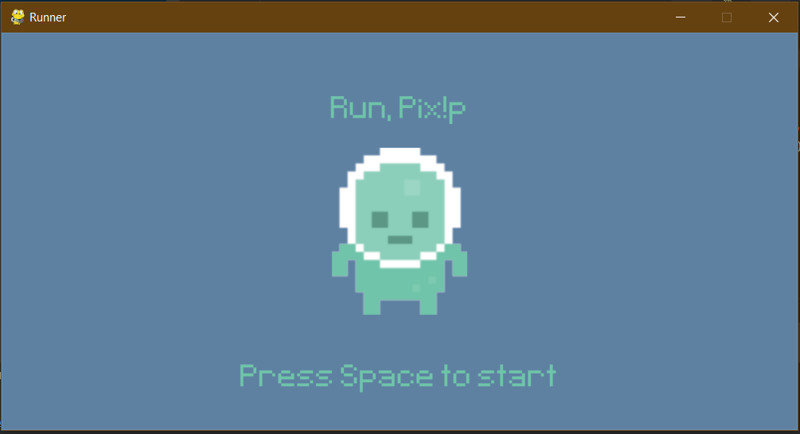
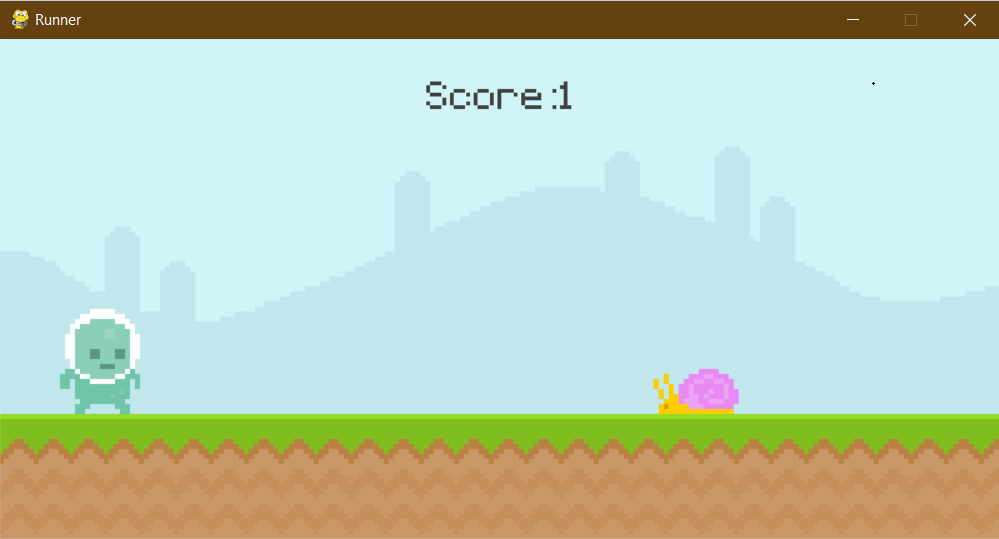

# Run, Pix!

Pixel game based on Google's "No internet connection" game

## Installing

To get started, follow these steps:

1. Clone the repository:

    ```bash
    git clone https://github.com/arcademiss/Run-Pix.git
    ```

2. Navigate to the project directory:

    ```bash
    cd Run-Pix
    ```

3. Create and activate a virtual environment (optional but recommended):

    ```bash
    python -m venv venv
    source venv/bin/activate  # On Unix or MacOS
    venv\Scripts\activate     # On Windows
    ```

4. Install project dependencies:

    ```bash
    pip install -r requirements.txt
    ```

## Play

Starting the game is simple. Follow these steps:

1. Run the application:

    ```bash
    python pixel_runner.py
    ```

    This will launch the start screen.

2. Press 'Space' and play!

## Screenshot




### Note

This is a for fun project, treat it as it is.